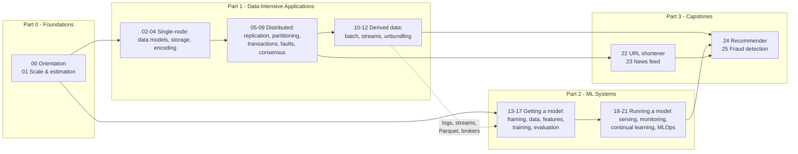
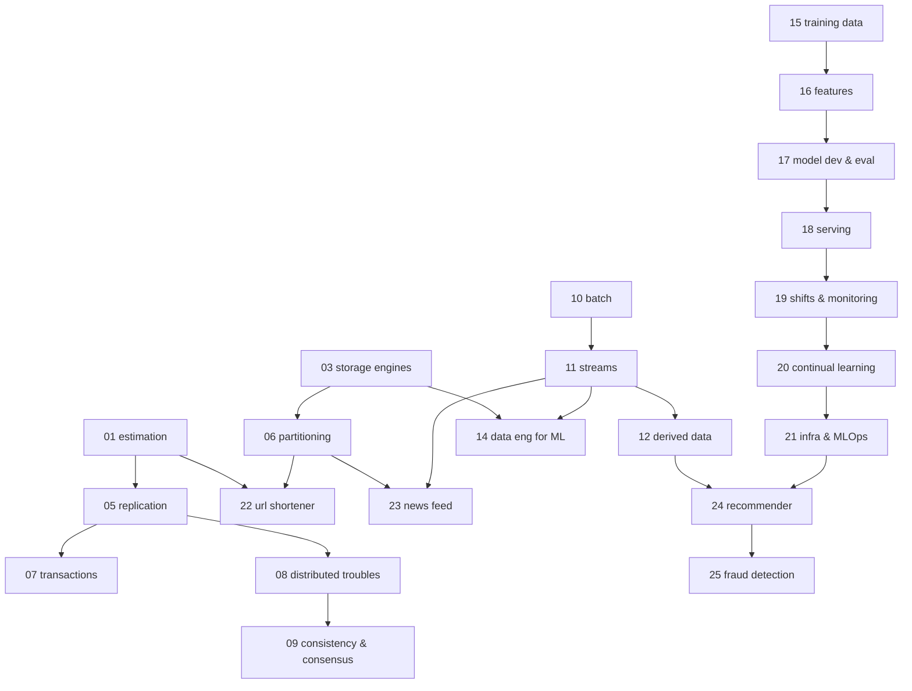

# Course Design

This document is the high-level design of the course itself: what it optimizes for, how it is
structured, the anatomy every notebook follows, and the engineering conventions that keep 26
notebooks consistent and verifiable.

## Goals

1. **Mastery, not familiarity.** Every core mechanism from *Designing Data-Intensive Applications*
   (DDIA) and *Designing Machine Learning Systems* (DMLS) is implemented, not just summarized.
   Building an LSM-tree teaches you what a paragraph about LSM-trees cannot.
2. **Failure-first pedagogy.** Wherever possible, a notebook first *reproduces the problem*
   (a stale read, a lost update, silent data leakage, a peeked A/B test) and only then builds the
   mechanism that fixes it. You remember problems you've watched happen.
3. **Self-verification.** A notebook is a set of claims. Inline `assert`s turn each claim into a
   check that re-runs every time, so the course cannot silently rot.
4. **Original content.** The books define the syllabus; all explanations, code, and diagrams here
   are original. Each notebook maps to book chapters for deeper reading.

## Structure

The two book tracks are deliberately ordered **data systems first**: DMLS assumes fluency with
storage formats, logs, batch/stream processing, and the reliability mindset that DDIA builds.
Part 2 then reuses Part 1's artifacts (the log broker from notebook 11 feeds the streaming
ingestion in notebook 14). The capstones force both tracks together.

## Notebook dependency map

Arrows mean "read this first" (beyond the default "read your part in order").

## Anatomy of a notebook

Every notebook follows the same template, in order:

| Section | Purpose |
|---------|---------|
| **Header** | Title, learning objectives, prerequisites, book-chapter mapping |
| **Concepts** | The theory: bolded terms with one-line definitions, diagrams, trade-off tables |
| **Build** | Working mini-implementations with explanatory comments and inline asserts |
| **Experiments** | Seeded simulations/benchmarks with plots that make the trade-offs visible |
| **Exercises** | 3-5 problems, followed by worked solutions |
| **Takeaways** | The compressed version you should retain + further reading |

Concepts and builds interleave (concept → build → next concept), so theory never runs far ahead
of code.

## Shared plumbing (`sysdes` package)

Lesson code lives *in* notebooks so each is a self-contained artifact. Only two genuinely
cross-cutting pieces are factored out:

- **`sysdes.viz`** — the three recurring diagram types, as code: architecture box-and-arrow
  diagrams (`system_diagram`), sequence diagrams (`message_timeline`), consistent-hash rings
  (`hash_ring`), plus the course plot style (`use_style`).
- **`sysdes.sim`** — a deterministic discrete-event simulator (`Sim`) with an unreliable
  network (`Network`: latency, loss, partitions) and protocol `Node` base class. Used by the
  distributed-systems notebooks (05, 08, 09) and capstones to reproduce timing-dependent
  anomalies reproducibly.
- **`sysdes.scratch_dir`** — per-notebook scratch directories under `~/tmp/sysdes-course/` so
  generated files (SSTables, Parquet partitions) never pollute the repo.

## Engineering conventions

- **Determinism**: all randomness through `numpy.random.default_rng(<fixed seed>)`. Same run,
  same numbers, same plots — which is what makes inline asserts possible.
- **Loud failure**: no bare `except`, no silently-skipped steps; asserts carry messages.
- **Speed**: each notebook targets < ~90 s end-to-end so `make test` stays practical.
  Benchmarks are sized to show the *shape* of a trade-off, not to stress hardware.
- **No network access** in notebooks; all datasets are synthesized in-notebook (which doubles
  as a lesson in how the data is shaped).
- **Outputs stripped** before committing (`make strip`), per repo policy.
- **Testing**: `tests/test_sim.py` and `tests/test_viz.py` unit-test the shared package;
  `tests/test_notebooks.py` executes every notebook end to end (marker `notebooks`).

## Authoring pipeline

Notebooks are authored as MyST-markdown sources and converted to `.ipynb` with
[jupytext](https://jupytext.readthedocs.io) (installed in the env). To regenerate a notebook's
source for heavy editing: `jupytext --to md:myst <notebook>.ipynb`.
